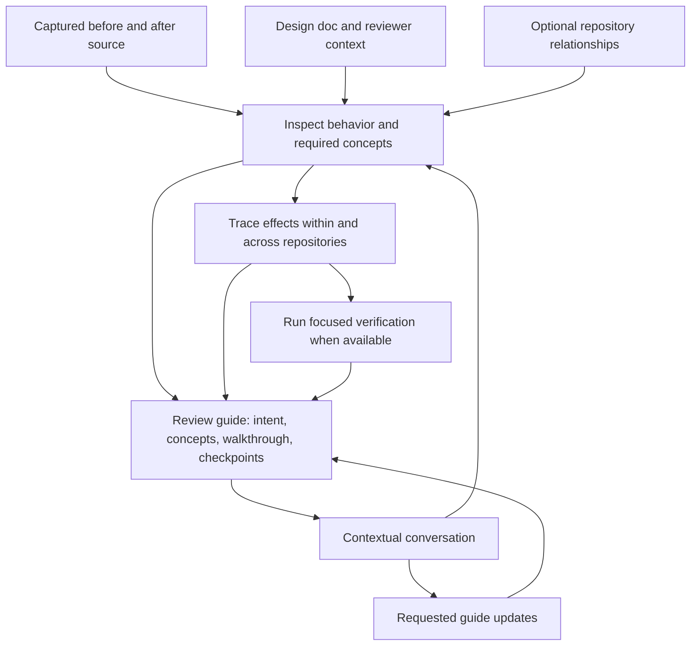

# Review Assistant: guided change review and impact investigation

Status: revised design proposal, 2026-09-18. Repository Relationships is
[implemented](../assets/skills/devcroft/references/relationships.md). Review Assistant
application implementation has not started.

Confirmed product direction: an interactive review session built around a rich,
evolving review guide. The first version helps the reviewer understand a change,
check it against intent, and investigate its effects, within one repository or
across related repositories. Teaching the concepts needed for that review is
part of the first version. Standalone exploration can follow later. Other choices
below are recommendations to validate during implementation.

## Product objective

Help the reviewer answer: **What do I need to understand, does the change match
the design, and what evidence do we have about its consequences?**

Start with the change being reviewed and any supplied design doc. Explain the
language and architectural concepts needed to follow the implementation, connect
requirements to code and tests, and trace affected contracts and assumptions.
The human owns the review conclusion. The assistant supplies a navigable guide,
contextual explanations, evidence, verification, and open questions.

A core scenario is reviewing agent-written code in an unfamiliar language, with
a design doc and no repository relationships. The reviewer should be able to
learn the relevant concepts, follow execution, inspect how the implementation
meets the design, and ask informed questions. Relationships are optional context;
their absence does not reduce this to an incomplete or blocked review.

The motivating example remains an RPC migration from a Python monolith to a Go
service. The migrated implementation omitted information required by restore.
Normal operation worked; the restore consumer lived in another repository.
Given high-level relationships and available source, a useful review should
connect the old producer, changed output, consuming code, and restore behavior.

Repository Relationships supplies a reusable starting map. The assistant turns
a particular change and that map into evidence about its effects. Graph
reachability establishes a candidate for investigation. Source inspection and
execution establish the consequence of the change.

## First-version experience

Open Review and choose **Review changes** for the current comparison. Attach a
design doc or requirement when available, and optionally select code or ask a
question. The reviewer can say "I understand the design but am unfamiliar with
this language" or name concepts they already know. No expertise questionnaire
is required. Preserve Review's full-diff and uncommitted scopes and display which
comparison is being captured.

Build the review guide progressively: establish intent, inspect the change,
identify necessary concepts, and walk through behavior. Let the reviewer read
freely or follow the walkthrough step by step. Introduce concepts at the code
locations where they help the reviewer make a decision.

Discover related repositories automatically, explain why each is relevant, and
read available source within the configured context scope. Let the reviewer
adjust versions, exclude context, attach missing source, or include a previous
implementation. Ask focused questions when information is missing while
independent investigation continues.

Show a concise overview with the guide's intent, concepts, walkthrough, review
checkpoints, and open questions. Surface supported concerns as they are found.
Selecting an explanation, code excerpt, or checkpoint provides context for a
follow-up: "Explain this expression," "Show this as pseudocode," "What happens
if this fails?", or "Does the CLI also use this?" Keep the conversation and
durable guide together in the same session.

The first version includes:

- One changed checkout and its exact before/after comparison.
- Guided review against an optional design doc, including the concepts needed
  for unfamiliar language features and architecture in this particular change.
- A rich, evolving guide with annotated code, useful diagrams, contextual chat,
  free reading or sequential walkthrough, and explicit Markdown export.
- Automatic relationship context and targeted inspection of related repositories,
  including unchanged files and both dependencies and dependents.
- Optional old/new implementation locations for migration reviews, including
  implementations without shared Git history.
- Evidence-linked concerns, explicit context gaps, follow-up questions, and full
  snapshot source navigation.
- Local durable sessions, one validated installed-agent runner, cancellation,
  freshness tracking, and a shared desktop/CLI interface.
- Isolated verification and deliberate handoff into human review feedback.

A standalone Assistant destination, general codebase exploration, automatic PR
import, and coordinated changes across several repositories are later extensions.
The session model can hold multiple comparisons without requiring all these
product flows in the first slice.

## The review guide and contextual conversation

The guide is the main reading surface and the durable result of the session.
Chat lets the reviewer direct the investigation and request explanation at the
point of confusion. Source navigation lets them inspect the implementation behind
each claim. All three share the same captured context and review history.

| Guide section | What it helps the reviewer do |
| --- | --- |
| Intent | Understand the design's expected behavior, constraints, and ambiguities. |
| Concepts | Learn the language, domain, and architectural ideas needed for this change, with links to their use in code. |
| Walkthrough | Follow the entry point, normal execution, failure paths, and recovery through annotated source and useful diagrams. |
| Review checkpoints | Connect each important requirement or invariant to implementation evidence, tests, and a review decision or question. |
| Open questions | See concerns, missing evidence, and explanations or verification still needed. |
| Reviewer notes | Preserve the human's understanding, decisions, and reasons. |

Keep explanations proportional to the change and the reviewer's stated needs.
For a background-retry change, the guide might explain error handling, task
lifetime, and duplicate effects. Give each concept a plain-language explanation,
a small example when useful, where it appears in the actual code, and why it
matters to review. Let the reviewer expand explanations or skip familiar material.
Avoid a general language course or mandatory quizzes.

Walk through behavior in execution order rather than file order. For example,
explain an early error return at the point where it prevents scheduling, then
connect that outcome to the design's recovery requirement. Distinguish exact
source excerpts from simplified examples and pseudocode. Diagrams should link
back to the relevant source and make simplifications clear.

### Conversation and guide updates

Questions can target a guide section, a checkpoint, or a source range. Preserve
that target with the turn so "Why does this happen?" stays meaningful after
navigating elsewhere. The reviewer can also ask a session-wide question at any
time, interrupt the walkthrough, and return to the same place afterward.

Answer follow-ups in context. For a question about retries, explain partial
success, show the relevant code, and identify any unresolved duplicate-effect
concern. Offer **Add to guide** for a useful explanation, or update the relevant
section when the reviewer explicitly asks for that. Initial guide generation
and requested updates can proceed incrementally without repeated confirmation.
Keep conversational detours in their threads; retain unresolved review questions
as visible checkpoints.

Apply guide updates to identified sections and keep their revision history.
Preserve human notes, understanding markers, and concern dispositions. A clearer
explanation does not resolve the associated correctness question or establish
that the reviewer understood it. Allow optional human markers such as
"Understood" and "Needs explanation," independent of review approval.

The guide is saved locally with its session and cited source versions. A
deliberate **Export guide** action creates a Markdown artifact containing the
selected guide content. It should remain readable without replaying the chat.

### Single-repository example

Given a design doc, an agent-written change, and a reviewer unfamiliar with its
language, the assistant should:

1. Extract the intended behavior and expose ambiguous requirements.
2. Inspect the implementation to select the concepts that matter for this review.
3. Explain those concepts beside the relevant source, using examples on request.
4. Walk through normal execution, failures, and recovery within the repository.
5. Map requirements to code and tests, exposing missing or contradictory evidence.
6. Answer follow-ups and preserve useful explanations and open questions in the
   guide so the reviewer can resume later.

Trace internal callers, shared state, and module contracts as needed. No saved
relationships is a valid starting condition. A known relevant repository with
unavailable source is a separate, explicit context gap.

## How relationships guide a review

Reuse the existing [relationship model](../assets/skills/devcroft/references/relationships.md) and
`src/data/relationships.rs`. Definitions remain high-level, portable knowledge.
Agents discover RPCs, fields, invariants, and workflows during a review; these
are investigation results, not additional mandatory relationship metadata.

Direction is **provider → consumer**. For a change in backend:

| Existing connection | Review question |
| --- | --- |
| api → backend | Does backend still honor the contracts supplied by api? |
| backend → ui | Does changed backend behavior break assumptions in ui? |
| backend → cli | Does the CLI depend on the changed behavior? |
| api → ui | Does ui interpret the shared contract differently from backend? |

Incoming dependencies establish requirements and provider behavior. Outgoing
dependents help investigate consequences. A consumer change can introduce a new
expectation of its provider, so both directions matter.

The installed discovery interface already exists:

```sh
devcroft repository relationships backend --json
devcroft repository relationships backend --depth 2 --json
```

Respect the actual query contract:

- `dependencies` and `dependents` contain direct neighbors at every depth.
- Expanded nodes carry a shortest **undirected** neighborhood `path` and
  `distance`. These are discovery routes, not causal impact paths. Explain
  propagation using original directed edges and source evidence.
- Default queries include all groups, independently of the graph page's current
  filter. An explicit review scope can restrict source access; record excluded
  connections instead of silently inheriting a UI filter.
- Check `diagnostics`, `truncated`, `excludedRelationships`, unresolved endpoints,
  and checkout availability. Registration does not imply usable source.
- Depth is bounded to 1–8 and responses to 1000 nodes. A limit is a context gap,
  not evidence that no additional consumers exist.

`truncated: false` does not mean the whole graph was explored: a neighborhood
query still has its selected depth. Record that discovery scope explicitly.

Record the graph responses used, query parameters, edge definitions and revision,
and included node metadata and revisions. The graph revision covers the
relationship document; repository purposes and groups have separate revisions.
Retain descriptions actually used so later edits cannot rewrite earlier context.

### Select context progressively

Start with the changed repository and its direct neighborhood. Inspect changed
behavior before selecting deeper source reads. A backend formatting change
should not trigger a full inspection of every UI and CLI.

For each potentially affected behavior, formulate a concrete question, such as
"Who reads the omitted restore metadata?" Inspect manifests, schemas, routes,
serialization code, callers, tests, and relevant configuration. Descriptions
guide the search; find the detailed dependency in source. Matching names alone
is insufficient for cross-language calls.

Expand when a contract question or observed behavior suggests another repository.
Follow a downstream effect further when it changes that consumer's own externally
visible behavior. Stop a path when evidence supports a stable contract, the
question is answered, context is unavailable, or the selected budget is reached.
State the reason and scope of that stop.

Cycles are valid. Deduplicate work by repository snapshot and investigation
question. One repository can participate in several workflows and roles; one
visit does not establish that all its relevant behavior was assessed.

Code can reveal dependencies absent from the map. Include their source when it
is available within the review's scope and record how they were discovered.
An empty or stale graph still permits local review. Suggested graph corrections
can be a later explicit save action; findings do not silently change shared
relationship definitions.

## Review workflow



1. **Capture the review.** Resolve the comparison, attached design/requirements,
   and any stated familiarity or learning needs. Save exact source and document
   versions, plus relationship context where available.
2. **Establish intent and assess the change.** Extract requirements and ambiguities,
   check local correctness, and identify changed behavior and assumptions. Read
   complete relevant source. Treat the author's explanation as intent to check.
3. **Build the guide and choose questions.** Explain necessary concepts and walk
   through execution. Map requirements to code and tests. Select local correctness
   and impact questions, including related repositories when relevant. Let the
   reviewer follow the guide or interrupt with a contextual question.
4. **Trace plausible effects.** Connect the producer or caller, changed contract,
   consuming code, and workflow. Inspect counterevidence: fallbacks, unused fields,
   version gates, feature flags, and changed requirements can explain compatibility.
5. **Verify where useful.** Propose or run a focused reproduction or consumer test
   using the session's configured capabilities. Record what actually ran.
6. **Update and continue.** Incorporate evidence and open questions into guide
   checkpoints. Answer follow-ups and apply requested explanatory updates. Reuse
   evidence from unchanged snapshots; preserve prior guide revisions and answers
   when refreshing context.

Keep a bounded question queue and visible progress such as "Inspecting restore's
reader for the changed RPC output." Finish a targeted question when answered.
Distinguish completed, cancelled, interrupted, budget-limited, and failed runs.
A completed run does not imply exhaustive review.

## What the reviewer receives

Organize the guide around intent, concepts, behavior, and workflows. Keep concerns
accessible throughout the walkthrough. An explanation can help someone understand
the code while leaving its correctness unresolved. A checkpoint should distinguish
implementation evidence, test evidence, missing verification, and human judgment.
Repository lists and the existing graph support context and navigation.

Each concern contains the changed behavior and before/after evidence; the
triggering input or workflow; the contract or assumption and relevant versions/
configuration; a trace through source to the consumer and customer effect;
counterevidence and remaining uncertainty; and a next check or possible remedy
where justified. Keep verification state and human disposition separate from
the assessment.

An illustrative migration concern could read:

> Restore may lose information after the RPC migration. The old implementation
> writes metadata M; the new implementation omits it. At the inspected consumer
> revision, restore reads M to reconstruct state. The normal request path does
> not exercise that reader. Verify by creating data through the new implementation
> and restoring it through the supported consumer version.

In a real result, each source claim links to its snapshot. Before reading the
consumer, the omission is an observed difference and the restore consequence is
an open question. After inspecting it, source can support a concern even when
execution is unavailable. A reproduction supplies separate evidence. An
intentional compatible omission should receive a scoped explanation of why the
consumer tolerates it.

### Evidence and coverage

Distinguish observed source behavior, recorded intent, inference, and execution
evidence. A proposed test is not a result; a graph description is not a verified
runtime dependency. Validate citation paths, ranges, content identities, and
snapshot membership before making links actionable. Structural validation makes
results inspectable but cannot prove the model's reasoning true.

Track coverage per behavior/question and repository snapshot:

| State | Meaning |
| --- | --- |
| Discovered | Relationship or source suggests context; it has not been inspected. |
| Investigating | A specific question is being checked. |
| Assessed | A scoped conclusion has evidence, whether concerning or compatible. |
| Unresolved | Source, version information, execution, or further reasoning is missing. |
| Excluded | Outside the selected scope or budget, with the reason retained. |

Report scope concretely: "Inspected backend and CLI at these revisions; UI source
is unavailable; the deployed CLI revision is unknown." Searches retain query,
snapshot, scope, limits, truncation, and exclusions. No matches is a scoped search
result, not proof that consumers do not exist.

Keep run status, concern assessment, coverage, freshness, human understanding,
and human disposition independent. A human can accept or dismiss a concern with
a note, mark an explanation understood, keep a question open, or ask for another
check. Resolving a comment, reading a section, or finishing an agent run does not
establish understanding or approval of the change. Do not produce a numerical
safety score or an "all consumers safe" verdict.

## Source identity and version assumptions

Default to the active Review comparison. Full diff means merge-base to captured
working tree; uncommitted means HEAD to captured working tree. Current Review
combines staged and unstaged work. Any later stage-only choice needs a distinct
capture and label.

Capture attached design docs and requirement excerpts with their source identity
and version/content hash. Guide checkpoints cite the intent that was actually
reviewed. If the design changes, preserve the old comparison and refresh against
the newly selected intent rather than silently rewriting the review criteria.

For uncommitted work, capture an immutable overlay over a commit containing
changed files, included untracked files, deletions, and content hashes. Record
unavailable files and exclusions. Detect concurrent edits during capture and
retry or expose inconsistency instead of mixing versions.

For automatically included related repositories, propose the checked-out HEAD
commit as the initial snapshot. Show that choice and any excluded dirty changes.
Allow another locally available revision or an explicitly captured working tree.
Checkout binding supplies location, not deployment information. Missing source
or an unavailable ref is a gap; graph queries do not imply fetching or cloning.

Local HEAD and the latest branch are not assumed to be deployed. Record the
version examined and why it matters. A missing deployed version limits release
compatibility conclusions while source review can continue. For migrations,
consider provider/consumer versions that actually coexist, stored data, restore,
and rollback. Avoid an exhaustive version matrix unless the rollout requires it.

For later coordinated repository changes, retain each before/after comparison
and assess relevant mixed-version combinations. Compatibility between all new
revisions alone does not establish rollout compatibility.

A citation contains repository identity, snapshot, path, line range, and content
identity. Resolve named refs to commit IDs and run source inspection against
captured versions, including native agent reads. Open the cited snapshot even
if the live checkout moves. A migration can attach old/new implementations from
different repositories as semantic comparison sources without shared Git history.
Unregistered local source can use a session-local identity, without automatic
graph discovery for that key.

Capture a repository when it enters scope and record the time. This is a set
of explicit source versions, not an atomic snapshot of a deployed system.
Reading more files from an existing snapshot preserves its identity. Adding a
repository/comparison, changing intent or versions, or adopting refreshed graph
context creates a new context generation. Reuse prior evidence only where its
inputs still apply. Late output from an older generation cannot replace the
current review.

Guide sections and contextual turns retain stable IDs, the guide revision they
refer to, and their evidence/context generation. Elaborating an explanation over
unchanged inputs creates a guide revision without recapturing source. Refreshing
source or intent makes affected walkthroughs and checkpoints need review again;
retain prior human notes and markers with their original context.

The run owner applies context expansion before accepting results that use it;
subsequent submissions identify the new generation. Expansion queries that find
a changed graph must adopt that context explicitly rather than mixing revisions
silently into an existing assessment.

Initially use conservative freshness: when selected sources or relationship/node
metadata used for context change, mark assessments as needing refresh. Preserve
older answers with their context. Track query/discovery scope as well as citations;
a new consumer or changed search result can matter even when cited lines remain
unchanged. Narrow invalidation only when dependency tracking supports it.

## Verification

Source inspection is the default. Tests and reproductions have concrete commands,
snapshots, environments, expected observations, and limits. Run in disposable
copies/worktrees with synthetic data where appropriate, keeping the reviewed
checkout available for ongoing work.

For a fix, seek a reproduction failing before and passing after plus targeted
neighboring cases. For a migration, replay shared inputs against old/new
implementations and exercise actual consumers. Include relevant side effects
and persisted data. Equal outputs for sampled inputs do not prove compatibility.

Store commands, working directories, source versions, environment details,
exit status, and bounded output as runner-recorded evidence. Generated test
candidates, accepted tests, and completed runs remain distinct. Record unavailable
services, environment mismatch, and inconclusive results explicitly.

Inspection, isolated verification, and implementation use distinct capabilities.
Existing authorization/configuration should avoid repetitive permission prompts.
Acting on a finding can use the coding-agent/comment workflow as a separate
action. Re-review resulting changes before claiming a concern was addressed.

## Session model and implementation seam

Use one deep investigation module shared by desktop and CLI, centered on a
change-review session and its guide. Its interface starts a session, applies a
question, guide action, or context action, reads state/events, and cancels a run.
It owns context capture, guide revisions, evidence validation, freshness,
lifecycle, and persistence. Callers do not assemble prompts or interpret
provider-specific events.

```text
ReviewSession
  id, title, objective, revision, context_generation
  reviewer_context       # optional stated familiarity and explanation preferences
  comparisons[]          # primary change initially; migration source pairs
  repository_snapshots[] # identities, versions, roles, capture details
  relationship_context[] # saved queries, edges, node metadata and revisions
  context_sources[]      # captured requirement/design, incident, author decision
  guide                  # stable section IDs, content, revision history, evidence links
  questions[]            # behavior, scope, reason, coverage state, conclusion
  turns[]                # section/source target, guide revision, questions/answers
                         # run/generation, progress, provider session identity
  evidence[]             # source, search, recorded execution, cited intent
  results[]              # behavior changes, impact traces, concerns, explanations
  reviewer_notes[]       # section/checkpoint target, understanding, human disposition
```

Keep the typed envelope small: identity, navigation, provenance, and state.
Guide sections hold readable prose, annotated snippets, diagrams where useful,
and links to evidence or results. Use the same concern/checkpoint identities in
the guide and conversation so an update cannot leave contradictory copies.
An impact trace is a session result rather than a permanent contract schema in
the relationship store. Keep guide and conversation actions accessible through
the shared CLI as well as the desktop.

| Location | Responsibility |
| --- | --- |
| `src/investigation/` (new) | Sessions, guide revisions, snapshots, evidence, lifecycle, persistence, private context-selection helpers |
| `src/investigation/runner.rs` (new) | First installed-agent integration; extract adapters when adding supported providers |
| `src/review/` | Review changes entry, guide, contextual conversation, result navigation, existing comments |
| Snapshot source view (new, initially under `src/review/`) | Read-only full source and cross-repository evidence navigation |
| `src/cli/` and `src/commands/` | New investigation commands calling the shared module; command grammar still to be designed |
| `src/data/relationships.rs` | Existing graph store and query interface, reused directly |
| `src/data/repositories.rs` | Existing repository catalog and device checkout bindings |
| `src/workspace.rs` | Review handoff and session lifetime across repository switches |
| `assets/skills/devcroft/` | Agent workflow and shared CLI discovery |

`src/review/git.rs` reads one checkout against HEAD or a merge base. Extract
reusable snapshot operations as needed; immutable comparisons and dirty overlays
require new work. Diff hunks and Git reads have limits, so obtain analysis source
separately and report unavailable content. Displayed hunks are incomplete input.

`src/agent_sessions/` discovers/resumes conversations; its metadata process helper
does not submit prompts. A structured runner is new work. Artifacts can supply
selected plans and receive exported guides or summaries; live sessions, guide
history, and source blobs need their own store.

### Agent execution

Use installed agents and the existing CLI/skill approach. Intended providers
remain OpenCode, Codex, and Claude, beginning with one validated provider.
Devcroft supplies reproducible context, result handling, and review navigation;
the agent performs source investigation. Add language-specific indexes only
when observed retrieval problems justify them.

Run a dedicated review conversation. Attach relevant author decisions as sources,
keeping intent distinguishable from interpretation. Do not submit hidden review
turns into the active implementation terminal.

The first capability experiment validates prompt submission, scoped access across
repository snapshots, incremental progress, structured results, output limits,
cancellation including child processes, and source-write restrictions. Determine
invocation from the installed version's documentation; terminal launch support
does not establish these capabilities.

Use supported structured output or a Devcroft-owned CLI ingestion path with
versioned input, fresh revisions, and idempotent submissions. Normalize progress
to a small set of events. Capture execution evidence from the runner rather than
reconstructing claims from terminal text. A run owner handles process lifetime
and restart recovery, including without the desktop.

Only advertise validated capabilities. Native filesystem tools and verification
commands must obey the selected scope and write restrictions; a prompt saying
"read only" is insufficient enforcement. Reuse provider runtime facilities where
they meet the contract. Otherwise narrow the supported capability or provider.

### Persistence

Store durable local sessions at `investigations/` under the selected Devcroft data
root, outside `portable/`, including guides, contextual conversations, reviewer
notes, and revision history. Retain cited source and design-doc blobs until owning
records are deleted. Regenerable retrieval indexes can live under `cache/`.

Use schema versions, cross-process locking, atomic writes, revision checks, and
idempotent run updates. Preserve interrupted runs accurately after restart.
Checkout paths, captured sources, and raw execution state remain local.
Relationships and repository descriptions retain their portable storage.
Exporting a selected guide or summary as a Markdown artifact is deliberate; it
does not automatically export raw conversations, source snapshots, or run logs.
Include the reviewed versions, selected excerpts, source paths, and evidence
limitations. Exported prose and diagrams need readable Markdown representations;
mark evidence links requiring the original local session so a recipient can
distinguish included evidence from material unavailable on their device. Retain
the originating session and guide revision on the export. Later guide edits do
not silently change the exported artifact.

## Review UI

Enter from the existing Review destination and give the guide the main reading
area while the assisted review is open. Show a compact overview and section
navigation, with the option to read freely or follow walkthrough steps. Keep
concerns and open checkpoints easy to reach without completing the walkthrough.

Open actual snapshot source alongside the guide when following evidence. Provide
a contextual conversation panel for a selected section, excerpt, or checkpoint,
plus a session-wide question entry. Show the current conversation target clearly
and preserve it when navigating. Offer Explain further, Show an example, Show as
pseudocode, and Add to guide as contextual actions rather than mandatory steps.

Adapt the layout to available space; a narrow window can switch between guide,
source, and conversation while preserving position and focus. Dismissing the
assisted review returns to the normal diff. Reserve no empty space for closed
panels. Keep run progress and cancellation accessible while reading the guide.

Expose inclusion reasons, inspected revisions, coverage, and gaps in a context
view. Use familiar repository names in explanations and keep hashes/revision
tokens in evidence details. Link to the existing Relationships page for edits.
A separate review graph visualization can follow later.

Open citations in full snapshot source, including unchanged files and other
repositories, while retaining the session and originating comparison. Show
before/after or producer/consumer locations together when needed. Source
navigation does not change a coding terminal's directory. Keep session lifetime
independent of the active repository view.

Allow human notes and concern disposition. Offer deliberate handoff into inline
feedback when a finding belongs to the active diff. Preserve provenance and
revalidate the anchor; otherwise keep a session concern. The current review CLI
lists/resolves/reopens/deletes comments but cannot create them or edit bodies.
CLI comment creation requires an explicit extension.

Keep optional understanding markers beside the relevant explanation. Display
guide updates and freshness in context, retaining notes and the reading position.
Provide Export guide with a choice of the whole guide or selected sections and
make its source/version context visible before saving the Markdown artifact.

## Delivery sequence and acceptance evidence

1. **Prove guided and cross-repository review through one installed runner.**
   Create a single-repository change with a design doc and a stated unfamiliar
   language. Demonstrate a grounded concept explanation, behavioral walkthrough,
   requirement checkpoints, and a contextual question that updates the guide.
   Also create a changed provider, shared contract, and unchanged restore consumer
   with only high-level relationships. Find the detailed restore dependency and
   include an intentional compatible omission as a counterexample. Validate the
   execution and evidence contract across both scenarios.
2. **Deliver the interactive guide journey.** Implement local sessions and guide
   history, immutable context, shared CLI, one runner, relationship context where
   applicable, validated citations, the guide as the main Review surface,
   contextual chat, and full source navigation together. Exercise both the
   single-repository learning journey and an uncommitted provider change affecting
   an unchanged consumer. Demonstrate cancellation, restart, missing source, and
   refresh while preserving guide revisions, answers, and human notes.
3. **Complete verification and reviewer handoff.** Add isolated experiments,
   captured results, human disposition, comment handoff, and Markdown guide export.
   Demonstrate a failing-before/passing-after reproduction and a neighboring case.
   Exercise old/new implementations across repositories and distinguish normal
   operation from restore behavior.
4. **Broaden from observed use.** Add remaining intended providers with adapter
   contract tests, coordinated changes, richer deployed-version inputs, explicit
   PR import, graph navigation, and relationship suggestions. Consider standalone
   explanation/exploration once the change-review journey is useful.

Steps 1–3 define the first release. Step 1 is an experiment, not completed product
support. Normal PR Open actions retain their browser behavior; a later explicit
review action can import context.

Acceptance scenarios must include:

- Review a repository with no relationships using a supplied design doc. Explain
  the necessary language/architectural concepts, follow normal and failure paths,
  and map important requirements to actual implementation and test evidence.
- Adapt explanation depth to stated familiarity and follow-up questions. Keep
  simplified examples distinguishable from actual source and preserve ambiguous
  requirements or unsupported claims as open questions.
- Ask from a selected guide section or source range, navigate elsewhere, and
  retain the original question context. Add a useful answer to the guide and
  resume the walkthrough without losing notes or reading position.
- Preserve human understanding markers independently of concern disposition and
  test results. Source/design refresh marks affected sections for renewed review
  while keeping the prior guide and human decisions inspectable.
- Reopen a saved guide and contextual conversation. Export selected sections as
  readable Markdown with version context and explicit limits on local evidence
  links; later session changes leave the saved export unchanged.
- Connect the omitted RPC information to restore through real consumer source,
  starting with only high-level relationships.
- Explain the compatible-omission counterexample with evidence instead of
  reporting an unsupported defect.
- With consumer source absent, report the producer difference and missing
  evidence, then continue the same review after attachment.
- Inspect incoming dependencies for new provider expectations; follow transitive
  consequences using directed relationships and verified source paths.
- Terminate cycles and bound inspection of irrelevant neighbors. Never present
  an undirected graph path alone as causal evidence.
- Expose missing/stale edges, filtered connections, graph limits, unavailable
  versions, and dirty related checkouts as context choices or limitations.
- Prevent source/metadata changes and late output from rewriting earlier context
  or replacing the current assessment.
- Keep evidence stable while a coding agent works; cancelling review stops owned
  processes without interrupting that coding agent.

Test the shared module through its desktop/CLI interface: capture consistency,
immutable citations, bounded queries, guide/section revisions, anchored turns,
human-note preservation, generations, malformed results, concurrent writes,
interruption recovery, export, and tool failures. Use real fixture execution to
validate test capture. Assess model quality separately through repeated scenarios
and human inspection, including whether concepts are relevant, explanations are
accurate, and checkpoints are grounded; Rust tests do not establish their quality.

For UI implementation, run the repository's Rust checks and a desktop smoke test
covering selection/comparison handoff, cross-repository source navigation,
guide reading and updates, contextual follow-up, understanding markers, repository
switching, cancellation, stale sections, comment handoff, and Markdown export.
The usefulness check is whether a reviewer unfamiliar with the language can
explain the implementation's key concepts, assess how it meets the design, and
identify behavior and verification gaps. For a cross-repository change, also
check whether they can explain the affected consumer workflow using the evidence.

## Questions for the first experiment

- Which installed provider meets the execution contract with least new work?
- What capture strategy gives consistent, practical access to large dirty
  worktrees while preserving exact citations and visible exclusions?
- What investigation budget discovers the restore dependency and counterevidence
  without examining every connected repository?
- What explanation depth helps a reviewer unfamiliar with the language follow
  the actual implementation and make informed review decisions?
- Which consumer verification environments run locally, and which require a
  recorded external or manual check?
- What layout keeps the guide, source evidence, and contextual conversation
  comfortable to navigate at different window sizes?

Initial defaults: the active Review comparison, an evolving guide as the main
surface, contextual conversation, explanation matched to the reviewer's needs,
source inspection first, optional relationship context with evidence-driven
expansion, local durable sessions, and reviewer-owned conclusions.
