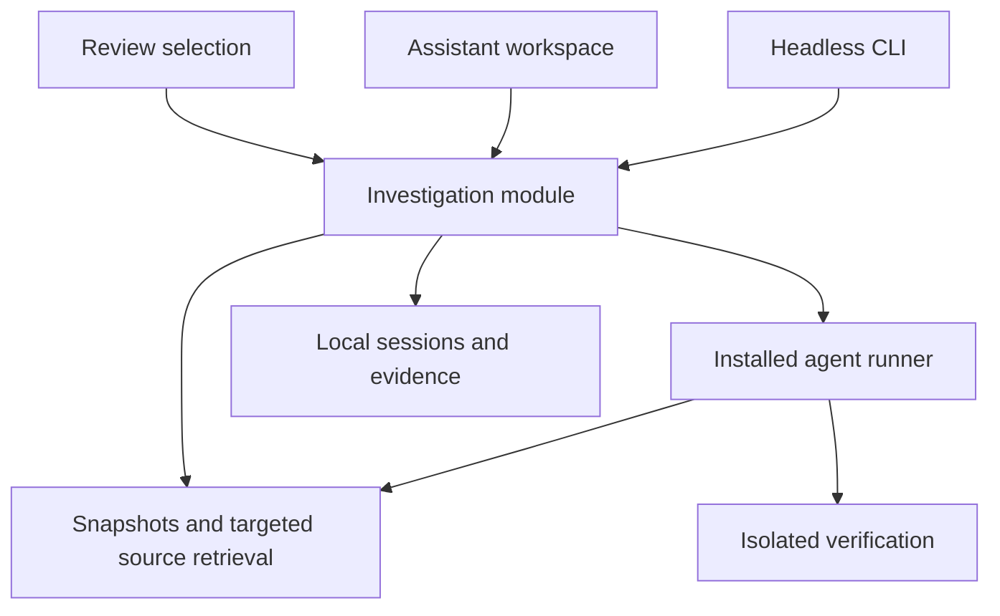

# Review Assistant: design and implementation proposal

Status: deferred until Repository Relationships is implemented. Application
implementation has not started. The active [Repository Relationships plan](repository-relationships-design.md)
defines the canvas, storage, and provider-to-consumer direction for that feature.

## Product objective

Help a human understand code, assess a change, and investigate customer behavior
that a change might break. The reviewer owns the conclusion. The assistant
provides explanations, evidence, experiments, and explicit unanswered questions.

The motivating example is an RPC migration from a Python monolith to a Go
service. The migrated implementation omitted information required by restore.
Normal operation worked, and the restore consumer lived in another repository.
The assistant should make the behavior difference visible, trace the consumer
when its source is available, and expose the missing context otherwise.

## One session model, several starting points

Use an investigation session as the shared model. A diff is optional. Repository
count and investigation purpose are independent: a small question can involve
two repositories, and a broad regression review can involve just one.

| Starting point | Initial context | Initial questions | Useful result |
| --- | --- | --- | --- |
| Understand code while building | Selected code and current working tree | What does this do? What calls it? Why this design? | Explanation and execution walkthrough |
| Review a local change | Before/after snapshots and an optional requirement | What changed? Which assumptions changed? | Behavioral brief, walkthrough, concerns |
| Verify a bug fix | Reproduction, expected behavior, before/after snapshots | Is the bug fixed? Which adjacent behavior could regress? | Reproduction evidence and focused regression scenarios |
| Explore a codebase | Repository snapshot and a question or entry point | Where does this behavior start? What are the invariants? | Navigable subsystem explanation |
| Review a migration | Old/new implementation locations and related repositories | What contract changed? Which consumer versions depend on it? | Behavior comparison and compatibility investigations |

These are editable starting presets, not separate engines or mandatory forms.
Default to the current checkout and selection. Let a question expand an existing
session with another focus, comparison, or repository without losing its notes.
An answer to a small question need not generate a full review report.

## Session data

Keep a small stable record with optional typed results:

```text
Investigation
  id, title, objective, revision
  context_generation
  repositories[]       # one or more repositories with selected snapshots
  comparisons[]        # zero or more before/after or implementation comparisons
  focuses[]            # selections, symbols, workflows, questions
  context_sources[]    # requirements, plans, incidents, author decision records
  turns[]              # questions, run state, answers, provider session identity
  evidence[]           # source excerpts, search records, recorded command results
  results[]            # explanations, walkthroughs, behavior differences, concerns
  reviewer_notes[]     # human conclusions and unresolved questions
```

A repository's role can be changed implementation, previous implementation,
consumer, or supporting context. One repository can have multiple roles and
snapshots. An unregistered local checkout can use a session-local identity;
registration is useful for reuse, not required for a quick explanation.

A comparison between implementations in different repositories is a semantic
comparison. It does not require shared Git history or pretend to be a normal
branch diff. A PR adds an exact base/head comparison plus available discussion
and requirements. It is another context source, not a separate analysis engine.

### Source identity and freshness

Resolve branch names to commit IDs. For uncommitted work, capture an immutable
overlay containing changed files, included untracked files, deletions, and their
content hashes over a commit. Record exclusions and unavailable content. Check
for concurrent edits during capture and retry or expose inconsistency rather
than silently mixing versions. Stage-only and whole-working-tree comparisons
must be distinct if both are offered.

Every source citation contains repository identity, snapshot, path, range, and
content identity. Open the cited snapshot even if the live checkout has moved.
Run source inspection against these snapshots so an actively coding agent cannot
change the evidence halfway through an answer.

Associate each turn with a context generation. Adding a repository or refreshing
sources creates a new generation; late output from an earlier generation cannot
overwrite newer results. Preserve earlier answers with their original context.
Initially mark results as needing refresh when any scoped source snapshot changes.
Later, narrow invalidation only where dependency tracking supports it, including
the scope of searches that found no matches. Unchanged cited lines alone do not
establish that a conclusion remains valid.

## How an investigation proceeds

1. Interpret the question and choose a starting focus. Briefly show the current
   scope and produce an initial useful explanation as soon as evidence permits.
2. Gather relevant source: the selected code, complete functions/files, callers,
   contracts, tests, requirements, and recorded decisions. Use bounded searches
   and targeted reads; do not put every repository into the prompt.
3. Form explicit questions. For a migration, compare observable behavior. For a
   bug fix, establish the reproduction and intended behavior, then inspect
   adjacent assumptions. For exploration, trace the requested execution path.
4. Query saved repository relationships to select relevant available context
   automatically, then follow evidence into other files or repositories. Show
   why repositories were included. Work within the user's configured context
   scope and carry unavailable context as a gap.
5. Answer with source links, or investigate a concrete concern. Run an applicable
   experiment when execution is within the session's selected capabilities.
6. Save useful results and remaining questions. Continue on follow-up without
   repeating completed searches against the same snapshot.

Keep a bounded question queue and visible progress. A quick explanation stops
after answering its question. A broader review can spend more time investigating
dependencies. Cancellation, budget exhaustion, unavailable context, and a finished
answer are distinct outcomes. A finished run does not mean exhaustive coverage.

Start with source searches, file/manifest discovery, Git history, and saved
repository relationships, with manual context overrides. The saved map provides
high-level descriptions; the agent discovers detailed dependencies by inspecting
code. Add symbol indexes or language-specific analysis only when measured
investigations show the need. Cross-language RPC investigations also require
schemas, routes, serialization code, and configuration; matching function names
is insufficient.

## Evidence and results

Return readable explanations with a small typed envelope for navigation and
state. A walkthrough references source locations. A behavior difference links
the implementations being compared. A concern links a trigger, dependency,
possible customer consequence, supporting evidence, and remaining uncertainty.

Distinguish these kinds of support:

- Observed source behavior: linked implementation at a recorded snapshot.
- Recorded rationale: a cited plan, decision, or discussion. This is an author's
  statement, not automatic proof that the implementation matches it.
- Inference: a reasoned interpretation that still needs checking.
- Execution evidence: a command, environment, snapshots, exit status, and bounded
  output captured by the runner. A proposed test is not a test result.

Validate result structure, citation paths, ranges, and snapshot membership before
making links actionable. Structural validation cannot prove an explanation true;
the sources and experiments remain inspectable. Unsupported conclusions become
questions or hypotheses rather than confirmed defects.

Keep run status, concern assessment, evidence freshness, and human review state
separate. An agent finishing a task or fixing code does not mark the human's
understanding complete. Avoid a numerical safety score or a claim that all
customer behavior has been covered.

## Repositories and customer workflows

Use Devcroft's proposed shared [repository relationships](repository-relationships-design.md)
feature for planning, review, implementation, and learning. A relationship contains
two repositories and a short high-level description, such as "B consumes A's
gRPC services" or "A uses the protobuf contracts defined in D." Query incoming
and outgoing connections automatically so the agent can find related source
without repeated manual attachment. The agent inspects that source to discover
specific contracts, fields, workflows, expectations, and tests. These details are
investigation results, not required relationship metadata. Provide simple forms
and lists for editing, with a graph view for exploration. Saved relationships
are context-discovery hints and are not treated as a complete or permanently
accurate dependency graph. Each session records which relationships and graph
revision informed its context, plus any user overrides.

For each consumer, record the version being examined and why it matters. The
latest branch is not assumed to be deployed. For staged migrations, investigate
the provider/consumer combinations that will actually coexist. Include older
stored data and restore behavior where the contract reaches persisted data.

When restore source is missing, the RPC omission can still be surfaced from the
old/new comparison. Its restore consequence remains unknown. When the repository
is attached, continue the same investigation and connect producer, omitted
information, consumer, and verification. Searches must record their scope,
truncation, and exclusions; no matches is not proof of no consumers.

## Verification

Source analysis is the default operation. Tests and reproductions are explicit
investigation actions with concrete commands, environments, and limits. Inspect
and run them in disposable copies/worktrees with synthetic data as appropriate;
the review does not modify the checkout being explained.

For a bug fix, useful evidence includes a reproduction failing before and passing
after, plus targeted neighboring cases. For a migration, replay shared inputs
against old and new implementations when feasible, compare observable outputs
and side effects, and exercise actual consumers. Equal outputs for sampled inputs
do not prove general compatibility. Some workflows need external services or
manual observation; record that limitation and the verification still needed.

Generated test candidates remain distinct from accepted tests and actual runs.
Record environment mismatch and inconclusive runs explicitly. Inspection,
verification, and implementation use distinct capabilities; existing user
authorization/configuration should prevent repetitive permission prompts.

## Implementation seams in Devcroft

Expose one deep investigation module shared by desktop and CLI. Its interface
supports starting a session, applying a user action/question, reading state or
events, and cancelling a run. It owns snapshot selection, evidence validation,
run lifecycle, freshness, and persistence. Callers do not manage provider event
formats or assemble prompts themselves.



Proposed initial ownership:

| Location | Responsibility |
| --- | --- |
| `src/investigation/` | Shared session model, source snapshots, validated results, persistence, run lifecycle |
| `src/investigation/runner.rs` initially | One concrete installed-agent integration; extract provider adapters when adding the next supported provider |
| `src/assistant/` | GPUI session view, context selection, questions, walkthrough and concern navigation |
| `src/data/relationships.rs` initially | Shared relationship records and queries for planning, review, and exploration |
| `src/assistant/source.rs` initially | Read-only snapshot source viewer for unchanged files and other repositories |
| `src/cli/investigation.rs` | Headless input/output translating into the same investigation interface |
| `src/workspace.rs`, `src/command_palette.rs` | Navigation, selection handoff, and keeping a session alive across repository switches |
| `assets/skills/devcroft/` | Agent-facing investigation workflow and CLI discovery |

These are ownership suggestions, not a requirement to create all files upfront.
Keep internal helpers private and split them as real responsibilities emerge.

### Reuse and current limitations

- `src/review/git.rs` currently compares a single checkout's working tree against
  HEAD or a merge base. Reuse relevant Git logic, extracting snapshot operations
  into a shared module as needed. Arbitrary immutable comparisons need new work.
- `src/review/model.rs` and its renderer intentionally cap diff output. Analysis
  must obtain complete source separately and report unavailable content; the
  displayed hunks are not a complete analysis input.
- `src/review/feedback.rs` already supports human line/range feedback. Hand a
  finding into that workflow when its location belongs to the active diff.
  Keep investigation notes separate, because they also cover unchanged files
  and multiple repositories. The current review CLI cannot create comments;
  any CLI handoff that creates them requires an explicit extension.
- `src/data/repositories.rs` and device checkout bindings supply the existing
  repository catalog. Use it for context selection without requiring all
  included repositories to have changes.
- `src/agent_sessions/` discovers and resumes conversations. Its metadata process
  helper explicitly does not submit prompts. A structured investigation runner
  is new work; it must not be assumed to exist in that catalog.
- `src/artifacts.rs` and `src/data/artifacts.rs` provide Markdown artifacts and
  originating-session links. Use them for selected plans and saved summaries,
  not as the storage format for every live run and source snapshot.

### Agent execution

Build on installed coding agents and Devcroft's headless CLI/skill approach.
Initial intended provider scope is OpenCode, Codex, and Claude, with one validated
provider first. Existing support for launching a harness in a terminal does not
imply support for structured assistant execution.

The first implementation task is a capability experiment: select an installed
provider and verify prompt submission, source access across scoped snapshots,
incremental results, cancellation including child processes, output limits,
and enforceable source-write restrictions. Verify structured result delivery and
test-result capture. Determine the concrete invocation from the installed
version's documentation; this proposal does not assume shared flags or protocols.

Run a dedicated investigation conversation. Attach relevant author decision
records/session excerpts as sources when available. Preserve the distinction
between recorded intent and the investigating agent's interpretation. Do not
submit hidden review prompts into the user's active implementation terminal.

Use validated JSON results through a supported provider output mechanism or a
Devcroft-owned CLI result-ingestion path (command naming remains to be designed).
Normalize provider progress into a small set of run events. Do not scrape the
terminal display to reconstruct claims. CLI mutations need versioned input,
fresh revisions, and idempotency for retried submissions. A run owner handles
cancellation and persistence; headless runs must also work without the desktop.

Only advertise capabilities validated for that provider. Native filesystem tools
must obey the same scoped snapshot and write restrictions as CLI retrieval; a
prompt saying "read only" is insufficient enforcement. Reuse installed-agent
runtime capabilities where they meet the contract. If they cannot, narrow the
first provider or capability rather than silently weakening the contract.

### Persistence

Propose durable machine-local records under the selected Devcroft data root at
`investigations/`, outside `portable/`. Keep regenerable retrieval indexes under
`cache/`. Retain source blobs referenced by saved results until their owning
records are deleted; they are not disposable cache entries.

Use schema versions, cross-process locking, atomic writes, revision checks, and
idempotent run updates. Mark interrupted runs accurately after restart. Keep
local checkout paths and run state local. Intentional relationship definitions
belong with portable repository metadata as described in the relationship
proposal; join local paths when querying. Saving a selected
summary as a Resources artifact is a deliberate export into the existing
portable store; raw run logs and snapshots are not exported automatically.

## User experience

Provide an Assistant destination that works even with no changes. The Review tab
can open the same session in a panel with the current selection attached. Start
from commands such as Explain selection, Check this change, Verify a fix, Explore
repository, and Compare implementations. They prefill intent and context.

Show the question and available repositories compactly. Expand context details
when needed. Present explanations first for learning, behavioral differences and
concerns first for regression work. Let the user switch between those views in
the same session. A guided walkthrough navigates actual snapshot code.

Follow a citation into another repository without replacing the session or
changing the coding terminal's working directory. A source pane is required:
the current diff stream alone cannot display arbitrary unchanged source. Full
source navigation is part of the first useful slice, not a cosmetic follow-up.

Allow the reviewer to pin conclusions, keep questions open, and revisit earlier
answers. Human understanding is separate from files viewed and comments resolved.

## Delivery sequence and acceptance evidence

1. **Runner capability experiment and fixtures.** Validate one installed provider
   against the execution requirements above. Create small controlled repositories
   for a local change, unchanged-code exploration, a bug fix, and the omitted RPC
   information with a restore consumer in a second repository. Include an
   intentional, compatible omission as a counterexample.
2. **One complete session journey.** Implement local session storage, immutable
   context, the CLI interface, one runner, validated citations, an Assistant view,
   and source navigation. Demonstrate both no-diff exploration and explanation of
   an uncommitted change. Cancellation/restart/freshness must work in this slice.
3. **Regression and migration investigations.** Add typed behavior differences,
   concerns, requirement/reproduction attachments, shared relationship queries,
   and old/new implementation comparisons. The relationship records, CLI, and
   forms can ship independently ahead of this step. Demonstrate automatic context
   selection for the cross-repository restore fixture using only high-level
   relationship descriptions. The agent must discover the detailed restore
   dependency from code. Show an honest gap when its consumer is unavailable.
4. **Verification and Review integration.** Add isolated experiments and recorded
   results, contextual entry from diff selections, human notes, review-comment
   handoff, and selected summary export. Show a failing-before/passing-after bug
   reproduction and a neighboring regression case.
5. **Broaden from observed use.** Add remaining intended providers with adapter
   contract tests, a relationship graph view, PR context import, incremental
   retrieval, and relationship suggestions. Introduce language indexes only when
   they solve demonstrated retrieval gaps.

The data model supports multiple repositories from the first slice. Saved
relationships select context automatically; automatic discovery of new
relationships comes later. Normal PR Open actions can retain
their current browser behavior; an explicit Investigate action imports context.

Test the investigation module through its desktop/CLI interface: no-diff input,
dirty snapshots, excluded/unavailable files, cross-repository citations, stale
generations, interrupted runs, malformed results, concurrent writes, and tool
failures. Use real fixture execution for verification capture. Assess model
quality separately with repeated scenario runs and reviewer inspection: finding
the true restore dependency, avoiding the compatible-omission false positive,
grounding explanations, and stating missing context. Passing Rust tests does
not establish the quality of model investigations.

For UI changes, run the repository's Rust checks and a desktop smoke test covering
selection handoff, snapshot citation navigation, repository switching, follow-up
questions, cancellation, and stale-answer display. Evaluate human usefulness by
whether the reviewer can explain the behavior, a design tradeoff, and a failure
path using the available evidence.

## Decisions to settle through the first experiment

- Which installed provider meets the minimum execution contract with the least
  integration work? Keep detailed provider protocol decisions behind that result.
- How much source capture is practical for large dirty worktrees? Preserve exact
  evidence and visible exclusions before optimizing retention or retrieval.
- Which test environments can be reproduced locally, and which require a recorded
  external/manual verification step?
- Does a compact Assistant panel suffice for everyday explanation, and when does
  a full session view become necessary? Validate with the same session model.

The initial defaults are current-checkout context, concise answers with expandable
sources, automatic context from saved relationships with manual overrides, source
inspection first, local durable sessions, and reviewer-owned conclusions.
